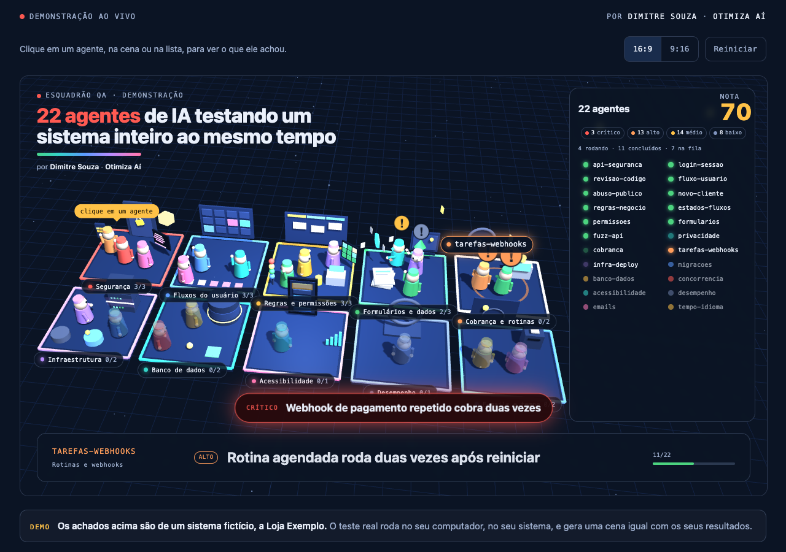

# Esquadrão QA

Um esquadrão de agentes de IA que testa o seu sistema e mostra o teste acontecendo numa cena 3D.
Funciona no **Claude Code** (app desktop ou terminal), em sistemas que rodam no seu computador ou em homologação.



Criado por **Dimitre Souza** · [Otimiza Aí](https://otimizai.net.br)

## O que você precisa
- Claude Code instalado, com plano pago. No chat comum do claude.ai não funciona.
- O seu sistema rodando em `localhost` ou em um ambiente de homologação.
- Node.js instalado (usado pela cena ao vivo). Sem ele, o teste roda, mas sem a cena.

## Instalar
No Claude Code, dentro da pasta do seu projeto:
```
/plugin marketplace add dimitresouza12/esquadrao-qa
/plugin install esquadrao-qa@esquadrao-qa
```

## Rodar
```
/esquadrao-qa:testar
```
Ele pergunta o endereço do sistema e o modo, mostra a lista de agentes que vai usar e só começa depois da sua confirmação.
Depois imprime um endereço local (`http://localhost:4777`). Abra no navegador para ver os agentes trabalhando.

## Modos
| Modo | Agentes | Quando usar |
|---|---|---|
| Ultraleve | 2: `api-seguranca`, `regras-negocio` | Primeiríssima checagem, ou plano com pouco limite sobrando |
| Leve | 5: `api-seguranca`, `login-sessao`, `fluxo-usuario`, `regras-negocio`, `fuzz-api` | Rodada normal |
| Completo | Até 22, conforme o que o seu sistema tem | Antes de um lançamento ou depois de uma mudança grande |

O catálogo completo, com o que cada agente testa, está em [docs/catalogo-de-agentes.md](docs/catalogo-de-agentes.md).

## Sobre o custo de uso
Cada agente é um subagente do Claude Code, e isso consome uma fatia real do limite do seu plano — não tem como cercar isso num teto exato, porque depende do seu plano e do que você já gastou na janela. O que a skill faz para pesar menos:
- Agentes de checagem mais mecânica (fuzz, formulários, tempo/fuso, e-mails, acessibilidade etc.) rodam num modelo mais leve (Haiku); os que pedem julgamento mais fino (segurança de API, permissões, regras de negócio) ficam no Sonnet.
- Cada agente tem um teto de turnos e instrução para ser direto: poucos casos de teste bem escolhidos, relatório curto.
- Os agentes rodam em lotes de 3, não todos de uma vez.
- Se o limite acabar no meio do teste, rode `/esquadrao-qa:testar` de novo: ele reconhece o que já rodou e continua de onde parou, sem pagar de novo pelos agentes concluídos.
Comece pelo ultraleve ou pelo leve antes do completo.

## O que ele nunca faz
- Testa só em `localhost` ou homologação. Se detectar produção, para e pergunta.
- Não usa credenciais de produção, não faz deploy, não faz push e não apaga dados reais.
- Não edita o código do projeto. Tudo fica em `.esquadrao/`.
- Cria dados de teste com o prefixo `QA` e só apaga com a sua confirmação.
- Pede permissão antes de instalar qualquer ferramenta.

## Como funciona
1. Um agente de reconhecimento lê o projeto e gera o mapa do sistema.
2. O mapa define quais agentes entram. Cada agente recebe um plano próprio.
3. Os agentes rodam em lotes e reportam o andamento em `.esquadrao/ao-vivo/`.
4. Um servidor local (só em 127.0.0.1) entrega esse andamento à cena 3D.
5. No fim sai o `.esquadrao/relatorio/RESUMO.md`, com a nota de risco estimada e os achados por gravidade.

Cada achado é marcado como **confirmado** (reproduzido, com evidência) ou **suspeita**.
A nota é um termômetro, não uma certificação. O formato dos arquivos está em [docs/formato-ao-vivo.md](docs/formato-ao-vivo.md).

## Experimente com segurança
`exemplos/alvo-demo` é um sistema minúsculo e propositalmente vulnerável:
```
node exemplos/alvo-demo/server.mjs
```
Depois rode `/esquadrao-qa:testar` apontando para `http://localhost:3999`.

## Limites
- Só sistemas web e APIs. Aplicativos nativos ficam de fora.
- Itens que só aparecem fora do localhost (HTTPS, cookie `Secure`, limite por IP real) não são cobertos.
- Os agentes erram. Revise os achados antes de agir.

## Modo gravação (para fazer vídeos)
Na página da demonstração, `#gravar` abre só a cena em tela cheia, começando do zero, e `#gravar-vertical` faz o mesmo em 9:16.

## Para desenvolver
```
node scripts/gerar-agentes.mjs   # gera plugin/agents/*.md a partir da tabela
node scripts/build.mjs           # gera site/dist (Vercel) e copia a cena para o plugin
claude plugin validate .
```
